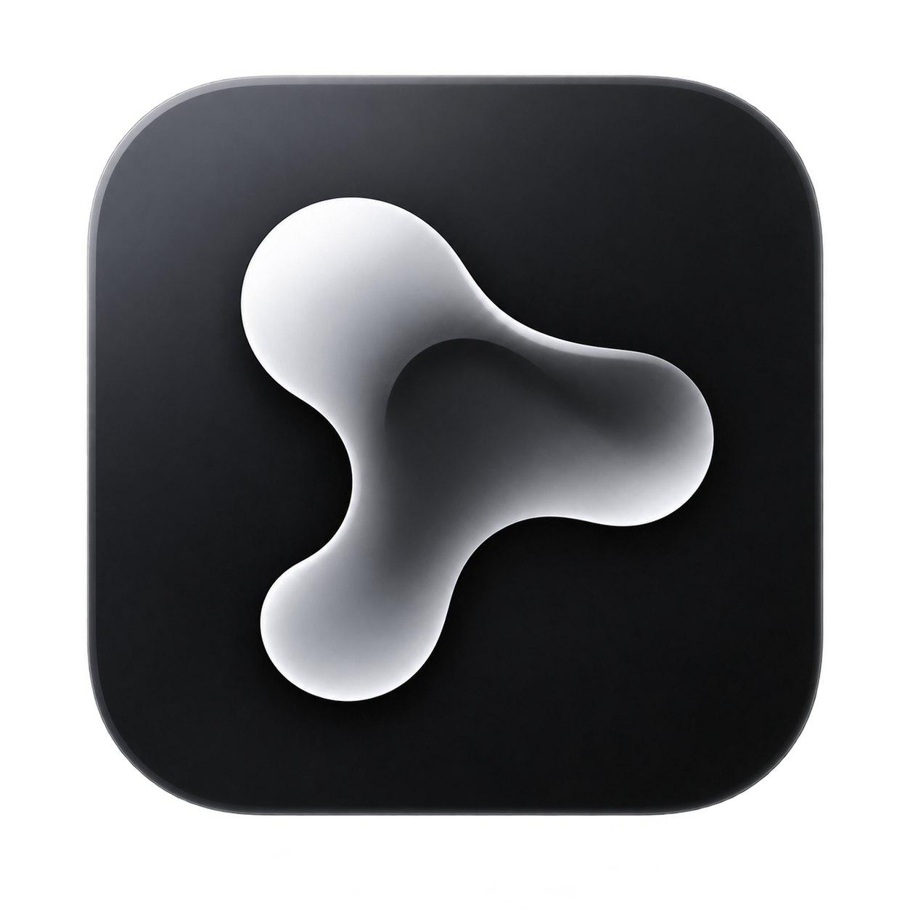
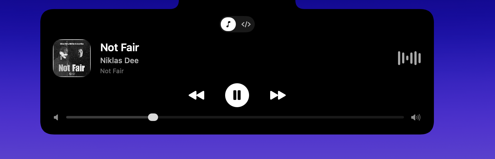
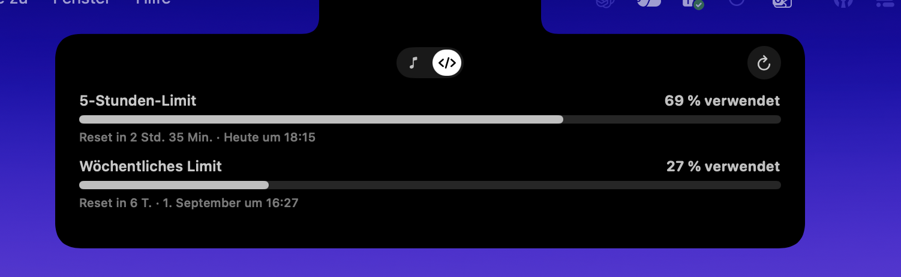
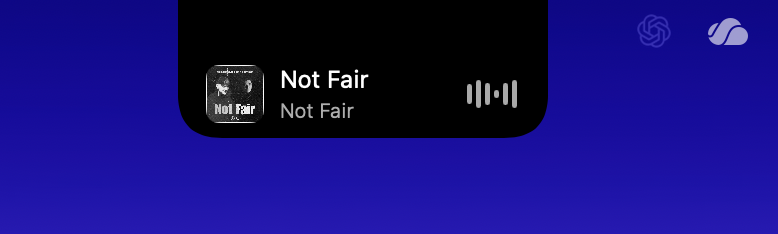
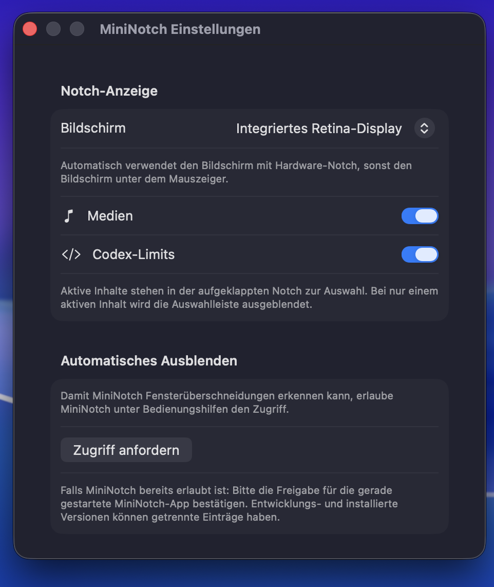
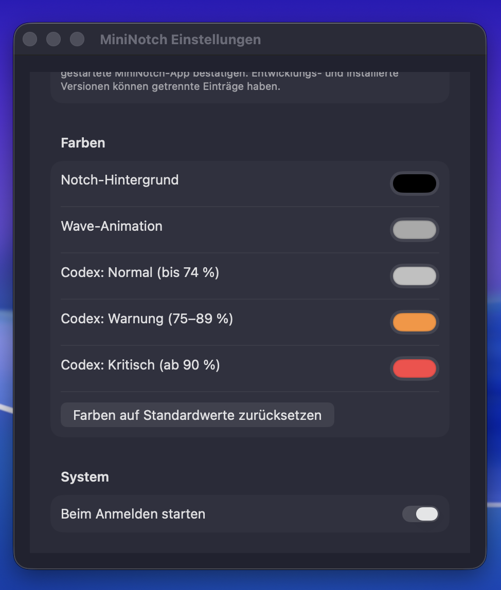

  

<h1 align="center">MiniNotch</h1>

<strong>Now Playing und Codex-Limits direkt in der MacBook-Notch.</strong>

  <a href="https://github.com/hammersebastian/mini-notch/releases/latest">DMG herunterladen</a>
  ·
  <a href="docs/DEVELOPMENT.md">Für Entwickler</a>

MiniNotch ist eine native Menüleisten-App für MacBooks mit Notch. Sie zeigt
aktuell laufende Medien – etwa Spotify oder YouTube im Browser – sowie deine
Codex-Limits direkt an der Notch an.

## Vorschau

<table>
  <tr>
    <td width="50%" align="center">
      
       Medien: aufgeklappte Player-Ansicht
    </td>
    <td width="50%" align="center">
      
       Codex: 5-Stunden- und Wochenlimit
    </td>
  </tr>
  <tr>
    <td align="center">
      
       Medien: kompakte Ansicht
    </td>
    <td align="center">
      
       Codex: kompakte Ansicht
    </td>
  </tr>
</table>

<table>
  <tr>
    <td width="50%" align="center">
      
       Einstellungen: Inhalte und Verhalten
    </td>
    <td width="50%" align="center">
      
       Einstellungen: Farben und System
    </td>
  </tr>
</table>

## Funktionen

- Titel, Interpret und Cover direkt an der Notch
- Spotify und andere macOS-Now-Playing-Quellen, z. B. YouTube im Browser
- Aufgeklappter Player beim Hover – mit Play/Pause, Zurück, Weiter, Timeline und Systemlautstärke
- Animierter Equalizer
- Codex-Limits: 5-Stunden- und Wochenverbrauch mit Restzeit und Rücksetzzeitpunkt sowie verfügbare vollständige Resets
- Medien- und Codex-Ansicht einzeln aktivierbar
- Farben für Notch, Wave-Animation und Codex-Status anpassbar
- Menüleisten-App ohne Dock-Icon, optionaler Start bei der Anmeldung
- Automatisches Ausblenden, wenn ein aktives Fenster die Notch überdeckt
- Ist keine Medienquelle aktiv, bleibt die Medienansicht unsichtbar

## Installieren

MiniNotch benötigt einen Apple-Silicon-Mac mit macOS 14 oder neuer und eine
MacBook-Notch. Xcode, Homebrew und ein Terminal sind auf dem Ziel-Mac nicht
erforderlich.

1. Öffne die [aktuelle Version auf GitHub Releases](https://github.com/hammersebastian/mini-notch/releases/latest) und lade `MiniNotch-x.y.z-arm64.dmg` herunter.
2. Öffne die heruntergeladene DMG mit Doppelklick.
3. Ziehe `MiniNotch.app` in den darin angezeigten Ordner **Applications**.
4. Starte MiniNotch aus **Programme**.

Die DMG enthält alle für die Medienerkennung benötigten Komponenten. Falls die
DMG noch nicht mit einer Apple Developer ID signiert und notarisiert ist, kann
macOS beim ersten Start einen Hinweis anzeigen. Öffne MiniNotch in diesem Fall
im Finder mit Rechtsklick → **Öffnen**.

## Erste Schritte

Starte Spotify oder spiele ein Video in einem Browser mit Media-Session-
Unterstützung ab. Sobald macOS eine Now-Playing-Quelle meldet, erscheint
MiniNotch an der Notch. Fahre mit der Maus darüber, um die Player-Ansicht zu
öffnen.

Über das Menüleisten-Icon öffnest du die Einstellungen und kannst Medien,
Codex-Limits, Farben, Autostart und das automatische Ausblenden anpassen. Für
das automatische Ausblenden fordert MiniNotch beim Aktivieren den benötigten
Bedienungshilfen-Zugriff an.

### Codex-Limits

Für die Codex-Ansicht muss auf dem Mac einmal `codex login` ausgeführt worden
sein. MiniNotch liest dafür ausschließlich die lokale Datei
`~/.codex/auth.json`, fragt die aktuellen Limits ab und speichert oder verändert
deine Zugangsdaten nicht.

## Hinweise

- Browser und Webseiten müssen ihre Wiedergabe an macOS melden. Spotify ist in
  der Regel am zuverlässigsten; YouTube funktioniert in unterstützten Browsern
  häufig ebenfalls.
- Cover können etwas später als Titel und Interpret erscheinen, weil macOS die
  MediaRemote-Metadaten zeitversetzt bereitstellt.
- Die Steuerung zum Spulen hängt von der jeweiligen Medien-App ab.

## Entwickeln und veröffentlichen

Anleitung für lokales Setup, Tests, Release-DMGs, Signierung, Notarisierung und
Projektstruktur: [Developer README](docs/DEVELOPMENT.md).

Die Lizenzhinweise für die in der DMG enthaltenen Drittanbieter-Komponenten
stehen in [THIRD_PARTY.md](THIRD_PARTY.md).
